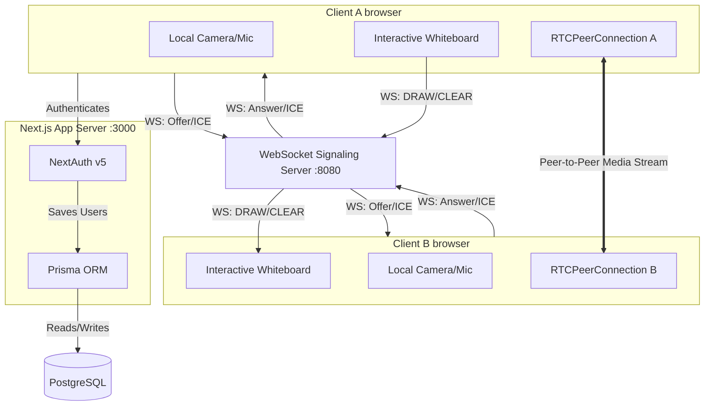
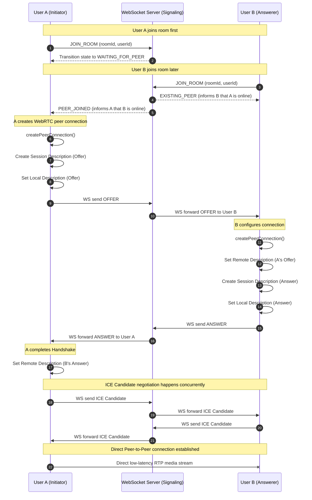

# TCS Prime Interview Prep Guide: x00m Video Conferencing App

This document provides a comprehensive technical breakdown of **x00m**, a real-time 1-on-1 video conferencing application featuring collaborative sketching. Use this guide to prepare for system design, networking, database, and scalability questions typical of a TCS Prime technical interview.

---

## 1. System Architecture Overview

The system is split into three layers: client-side interfaces, backend web services (Next.js & NextAuth), and real-time signaling/data synchronization (WebSockets & WebRTC).



### Technology Stack Summary

| Technology | Purpose | Key Benefit |
| :--- | :--- | :--- |
| **Next.js 15 (App Router)** | Frontend & Server-Side Rendering (SSR) | Unified routing, Server Components for fast page loads, and built-in API support. |
| **React 19** | Component-based UI Library | Concurrent rendering support, action hooks, and optimized state management. |
| **NextAuth.js v5 (Beta)** | User Authentication | Secure OAuth via external identity providers (Google). |
| **Prisma ORM** | Database Layer abstraction | Type-safe database queries and automated schema migration handling. |
| **PostgreSQL** | Relational Database | ACID compliance, reliable relational modeling. |
| **WebSockets (ws)** | Real-time signaling & whiteboard synchronization | Continuous bi-directional socket connection with low frame latency. |
| **WebRTC (P2P)** | Real-time media streaming | Direct Peer-to-Peer (P2P) audio/video transfer with minimum latency. |

---

## 2. Database Schema Design

The schema is defined in [schema.prisma](file:///d:/Projects/x00m/prisma/schema.prisma):

```prisma
model User {
  id        String    @id @default(cuid())
  email     String    @unique
  name      String?
  image     String?
  meetings  Meeting[]
  createdAt DateTime  @default(now())
  updatedAt DateTime  @updatedAt
}

model Meeting {
  id        String   @id
  creatorId String?
  creator   User?    @relation(fields: [creatorId], references: [id])
  createdAt DateTime @default(now())
  updatedAt DateTime @updatedAt
}
```

> [!NOTE]
> **Key Database Design Choices:**
> * **CUID (Collision-resistant Unique Identifier)** is chosen for the user primary key instead of standard UUID. CUIDs are designed specifically to be sorted chronologically and are URL-safe, minimizing collision risk in horizontally distributed architectures.
> * **One-to-Many Relational Mapping**: The creator of a meeting is mapped to a `User` record via `creatorId`.

---

## 3. Authentication & Page Guards

* **NextAuth Configurations**: Located in [auth.ts](file:///d:/Projects/x00m/src/lib/auth.ts) and [userData.ts](file:///d:/Projects/x00m/src/lib/userData.ts).
* **JWT Strategy**: Session data is cached inside signed JSON Web Tokens (JWTs) in a secure cookie, avoiding database lookup overhead on every page load.
* **Server-Side Page Guarding**: In [page.tsx](file:///d:/Projects/x00m/src/app/%28meeting%29/room/%5BroomId%5D/page.tsx), we retrieve the user session *before* delivering HTML to the browser:
  ```typescript
  const user = await getCurrentUser();
  if (!user) {
    redirect("/"); // Triggers a 307 temporary redirect immediately
  }
  ```
  Executing this on the server saves bandwidth, prevents flashes of unauthenticated content, and avoids client-side validation bypasses.

---

## 4. Real-time Signaling & WebRTC Deep Dive

WebRTC (Web Real-Time Communication) provides direct P2P audio and video transmission. However, browsers cannot connect directly without a setup mediator (the **Signaling Server**) and traversal assistance (the **STUN/TURN Servers**).

### A. The Signaling Server
The server defined in [index.ts](file:///d:/Projects/x00m/src/server/index.ts) listens on Port 8080 and handles connections via the `ws` library.
* **State Management**: It tracks active connections in memory using nested Maps:
  `rooms = Map<roomId, Map<userId, WebSocket>>`
* **Room Capacity Rule**: Restricts connections to 2 peers.
* **Relay Operations**: When it receives WebRTC specific payloads (`OFFER`, `ANSWER`, `ICE`) or interactive whiteboard elements (`DRAW`, `CLEAR`, `PEER_STATE`), it checks the destination (`msg.to`) and relays the payload to that peer socket.

### B. Detailed WebRTC Connection Protocol Flow



### C. STUN vs TURN Server Concepts
* **STUN (Session Traversal Utilities for NAT)**: Used to discover a browser's public IP address and port behind a NAT. STUN queries are lightweight, and Google's public STUN servers (`stun.l.google.com:19302`) are utilized in [RoomClient.tsx](file:///d:/Projects/x00m/src/app/%28meeting%29/room/%5BroomId%5D/RoomClient.tsx#L226-L231).
* **TURN (Traversal Using Relays around NAT)**: In ~20% of network conditions (e.g., symmetric NATs or corporate firewalls), direct connections are entirely blocked. Traffic must be routed through a third-party relay (TURN server). Since TURN relays raw audio/video data, it requires dedicated media server resources (e.g., CoTURN deployment).

> [!IMPORTANT]
> **ICE Candidate Queue Handling**:
> In WebRTC, ICE candidates can arrive via WebSockets before the browser has finished setting the remote description (`setRemoteDescription()`). If applied immediately, the browser throws an error.
> **x00m's solution**: In [RoomClient.tsx](file:///d:/Projects/x00m/src/app/%28meeting%29/room/%5BroomId%5D/RoomClient.tsx#L327-L338), candidates arriving early are buffered in `iceQueueRef` and applied sequentially *only* after `setRemoteDescription` completes successfully.

---

## 5. Collaborative Whiteboard Mechanics

The app hosts a collaborative whiteboard synced in real-time.

### Resolution Mismatch & Coordinate Normalization
If User A uses a high-resolution $2560\times 1440$ display and User B uses an $800\times 600$ display, raw pixel coordinates cannot be synchronized directly.
* **Coordinate Mapping**: Coordinates are mapped to normalized coordinates (values between $0.0$ and $1.0$ relative to screen boundaries) before sending:
  ```typescript
  const getRelativeCoords = (e: React.MouseEvent<HTMLCanvasElement>) => {
    const canvas = canvasRef.current;
    if (!canvas) return { x: 0, y: 0 };
    const rect = canvas.getBoundingClientRect();
    const x = (e.clientX - rect.left) / rect.width;  // Range: 0 to 1
    const y = (e.clientY - rect.top) / rect.height;  // Range: 0 to 1
    return { x, y };
  };
  ```
* **Drawing on Receiver**: The receiving client multiplies these fractional points by their local canvas width/height to render lines in the correct relative location:
  ```typescript
  ctx.moveTo(x0 * canvas.width, y0 * canvas.height);
  ctx.lineTo(x1 * canvas.width, y1 * canvas.height);
  ```

---

## 6. TCS Prime Technical Interview Q&A

### Q1: What is the main difference between WebSockets and WebRTC?
**Answer**: 
* **WebSockets** run over **TCP** (Transmission Control Protocol). They provide reliable, ordered, bi-directional transmission, but TCP congestion controls can introduce latency. Perfect for signaling metadata, user actions, or canvas strokes.
* **WebRTC** runs primarily over **UDP** (User Datagram Protocol) via SRTP (Secure Real-time Transport Protocol). It is built for real-time media where low latency is critical. If a video packet is lost, WebRTC drops the frame rather than blocking execution to request a retransmission.

### Q2: How does WebRTC security work? Is it encrypted?
**Answer**: Yes, WebRTC enforces end-to-end encryption.
* **Media Encryption**: Transmitted streams are encrypted using **SRTP (Secure Real-time Transport Protocol)**, and keys are securely exchanged via **DTLS (Datagram Transport Layer Security)**.
* **Signaling Channel Security**: WebSockets should be run over `wss://` (WebSocket Secure) to ensure TLS encryption. User sessions are verified using JWTs generated by NextAuth.

### Q3: How would you scale the WebSocket signaling server horizontally to handle millions of rooms?
**Answer**:
Currently, the room states are stored in Node.js server memory. In a multi-server production environment (behind a load balancer), users in the same room might land on separate servers and fail to communicate.
* **Solution**: Integrate a **Redis Pub/Sub** message broker. When a server instance receives a signaling message from a user, it publishes it to a Redis channel bound to that specific `roomId`. All other server instances subscribe to Redis channels and push incoming updates to their locally connected WebSocket clients.

### Q4: WebRTC Mesh architecture works for 2 users. How would you scale this to 50 users?
**Answer**:
The current setup uses a **Mesh** configuration where every user connects directly to every other user. The bandwidth requirement scales quadratically: $O(N^2)$ connections. For large calls, we must adopt a media server architecture:
* **SFU (Selective Forwarding Unit)**: Users upload exactly one stream to the media server, and the SFU distributes copies to the other $N-1$ participants. This dramatically reduces client-side CPU usage and bandwidth. (e.g., LiveKit, MediaSoup).
* **MCU (Multipoint Control Unit)**: The server decodes, combines, and re-encodes all incoming streams into a single layout video feed, sending only one downstream to clients. This is computationally expensive for servers but works on ultra-low-end client devices.

---

## 7. Troubleshooting & Verification Checklist

To verify your code locally before or during a live demonstration:
1. Ensure the PostgreSQL DB is running and Prisma migrations are applied: `npx prisma db push` or `npx prisma migrate dev`.
2. Start the signalling WebSocket server: `npm run dev:socket` (runs `src/server/index.ts` via ts-node).
3. Start the Next.js development server: `npm run dev`.
4. Open two browser windows (one in Incognito Mode) at [http://localhost:3000](http://localhost:3000) to test the 1-on-1 signaling flow and whiteboard drawing. Check browser console logs for WebRTC connection state updates (`pc.onconnectionstatechange`).
